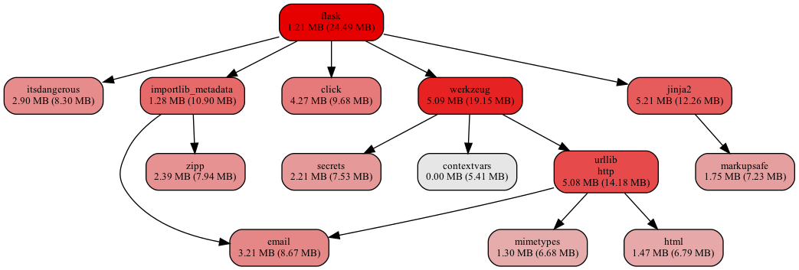

# importmem

This is a simple script to analyze how much memory needed to import Python
module dependencies.

## Installation

```
pip install importmem
```

## Example

```
importmem flask --open
```


